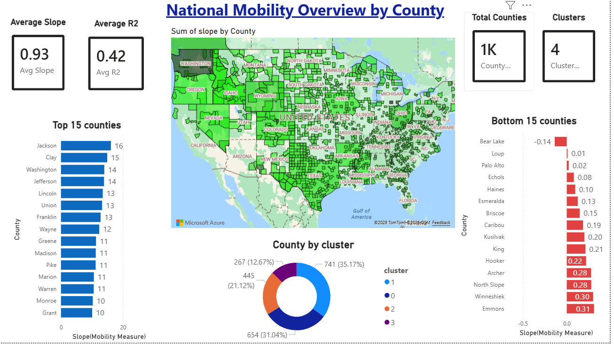
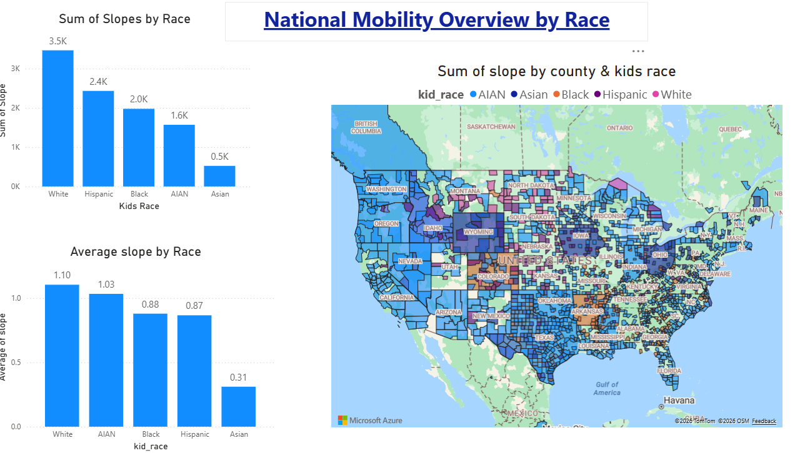
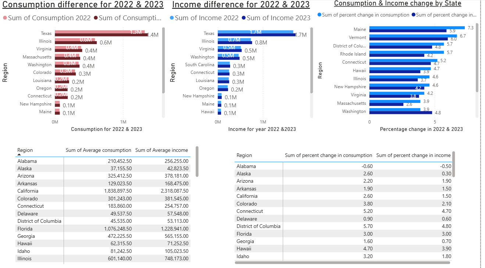
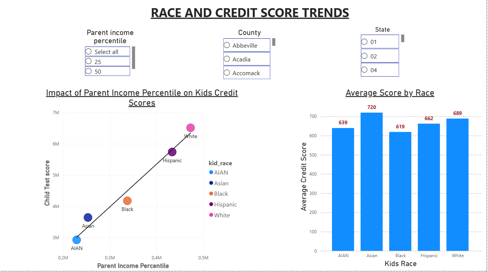

# National Mobility & Socioeconomic Insights

## 📊 Project Overview
This Power BI dashboard analyzes national mobility trends across counties, racial groups, and states in the United States. The project explores how race, credit score trends, and income consumption patterns relate to socioeconomic mobility outcomes. The goal is to identify disparities and uncover meaningful insights through interactive data visualization.

---

## 🛠 Tools Used
- Power BI
- DAX
- Data Modeling
- Data Cleaning & Transformation

---

## 📷 Dashboard Preview

### 1️⃣ National Mobility Overview by County

This dashboard provides a county-level analysis of mobility patterns across the United States. It highlights geographic differences in upward mobility and allows comparison between regions.

---

### 2️⃣ National Mobility Overview by Race

This view analyzes mobility outcomes across different racial groups. It helps identify disparities and trends in economic advancement among populations.

---

### 3️⃣ Income and Consumption Analysis

This dashboard explores income distribution and consumption patterns across states. It provides insights into spending behavior and economic differences at the state level.

---

### 4️⃣ Race and Credit Score Trends

This section examines the relationship between race and credit score trends over time. It highlights potential financial disparities and long-term socioeconomic patterns.

